> In this report, we first introduce the topic of 3D scene representation as a whole. We briefly go over classical approaches and explain some of the common issues preventing them from rendering a high-quality scene. Then, we discuss three deep learning based approaches in more depth, taking Neural Radiance Fields (NeRFs) as our starting point. Instant NGP improves upon the original NeRF paper by suggesting a hash encoding of inputs to the MLP that speeds up training at least 200x. Zero-1-to-3 combines NeRF and diffusion to offer extraordinary zero-shot scene synthesis abilities. Lastly, we give the most attention to 3D Gaussian Splatting, which represents the entire scene as a set of 3D Gaussians, enabling efficient training time and real-time scene rendering.

<!--more-->

{: class="table-of-content"}

- {:toc}

## Introduction to 3D Reconstruction

3D reconstruction plays a vital role in computer vision by providing a means to produce accurate, robust 3D scenes from a sets of 2D images. Classical methods, such as Structure from Motion (SfM) and Multi-View Stereo (MVS), leverage information from many 2D viewpoints to estimate the 3D geometry and depth of scenes. Auxiliary methods like depth from defocus help to address some of critical error points in 3D reconstruction like occlusion and sparse textures in images by producing key information like depth and focus information. These techniques can be combined into pipelines to create accurate 3D scenes and models, but more modern techniques like NeRFs, Instant NGP, Zero-1-to-3, and 3D Gaussian Splatting, have utilized deep-learning based techniques to surpass the limitations of classical methods and produce highly accurate, detailed 3D reconstruction results. These 3D reconstruction methods have been proven essential for applications ranging from robotics and autonomous navigation to virtual reality and even cultural heritage preservation.

### Structure from Motion (SfM)

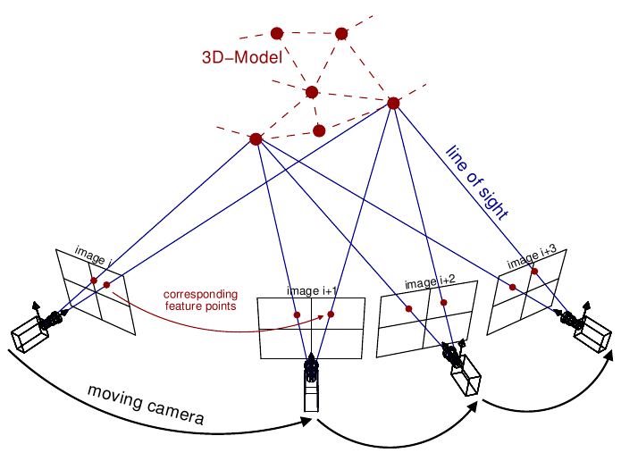
*Figure 1. SfM: Classical approach to 3D scene reconstruction [11]*

SfM stands as one of the key pillars of classical 3D reconstruction methods within the realm of computer vision dating all the way back to the 1979 paper, "The interpretation of structure from motion". Specifically, SfM focuses on the reconstruction of 3D scenes from a series of 2D images captured from various viewpoints (which can be seen in the figure above). SfM detects and matches distinctive features across the images to establish correspondence between the images, which then faciliates the estimation of camera poses and a sparse 3D reconstruction of the scene. This method involves triangulation between the rays projected from each calculated camera pose and a bundle adjustment optimization algorithm to adjust camera pamereters and minimize reprojection errors across the images. Overall, SfM provides a solid groundwork for understanding scenes through 3D images, and it can be used as a first step in many 3D scene resonstruction pipelines to estimate camera parameters for images and produce a baseline sparse 3D reconstruction to be iterated on.

### Multi-View Stereo (MVS)

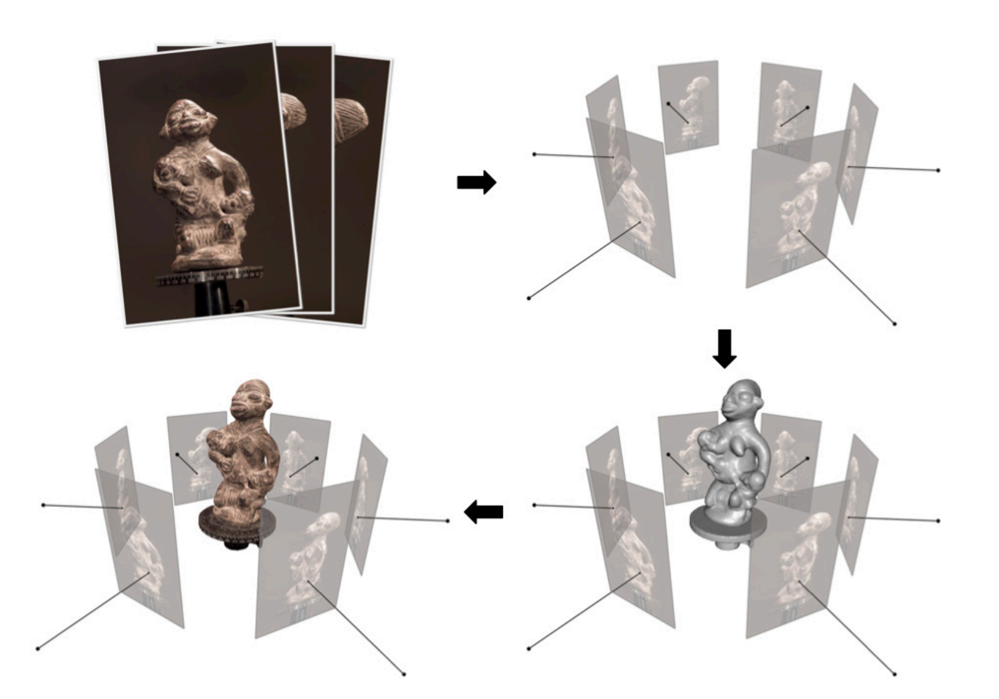
*Figure 2. MVS: Dense 3D scene reconstruction from SfM parameters pipeline [12]*

Multi-View Stereo (MVS) is a complementary technique to Structure from Motion (SfM), aiming to improve its sparse reconstructions with more dense 3D reconstructions. Unlike SfM, which focuses on estimating camera poses and creating a sparse 3D structure, MVS aims to generate more detailed geometry by estimating depth information for every pixel across multiple images with methods like depth from defocus or stereo matching. By utilizing information from multiple viewpoints, MVS overcomes limitations such as occlusions and ambiguities present in individual images, resulting in more accurate reconstructions. Additionally, MVS integrates with SfM pipelines, using the sparse reconstructions obtained from SfM as input to refine and densify the reconstruction. This is adjacent to more modern pipelines that utilize SfM and its generated basis of camera parameters and sparse reconstructions with a method like deep learning. MVS has also been iterated upon and even applied as a deep learning network in more modern implementations.

### Depth from Defocus

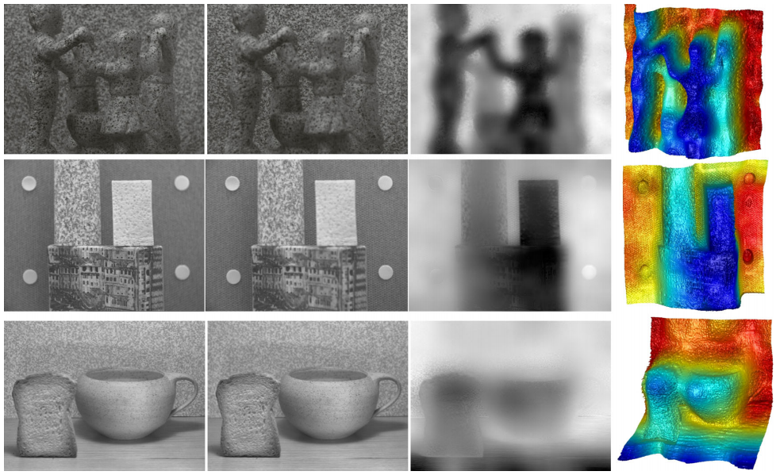
*Figure 3. Depth from defocus visualizations [13]*

Depth from defocus is commonly used in MVS pipelines to estimate depth map information for 3D scene reconstruction. It utilizes variations in image blur caused by defocus at different depths within an image. By analyzing the degree of defocus across multiple images of the scene, depth from defocus algorithms can estimate the depth of objects in the scene. Depth from defocus complements other depth estimation techniques like stereo matching and can be useful in datasets with complex regions, such as low-texture or occluded areas. By incorporating depth from defocus alongside other depth estimation techniques, MVS and even other more modern deep-learning based pipelines can achieve more accurate reconstructions in challenging environments and imagery.

## Problems with classical approaches

### Ambiguity

Baseline SfM only does not account for scaling.
As seen below, if any linear transformation Q is applied to the projection matrix,
its inverse can be applied to the points matrix, implying that transformed represetations
may be judged as equivalent.

$$ x = {PX} = {(PQ^{-1})(QX)}$$

        x - Correspondence
        P - Projection matrix
        X - Points matrix
        Q - Transformation

According to the different types of 3D representations seen below in Figure 1, we find that we can only generate projective reconstructions of an input scene. We would need additional information for affine/similar/euclidean representations.

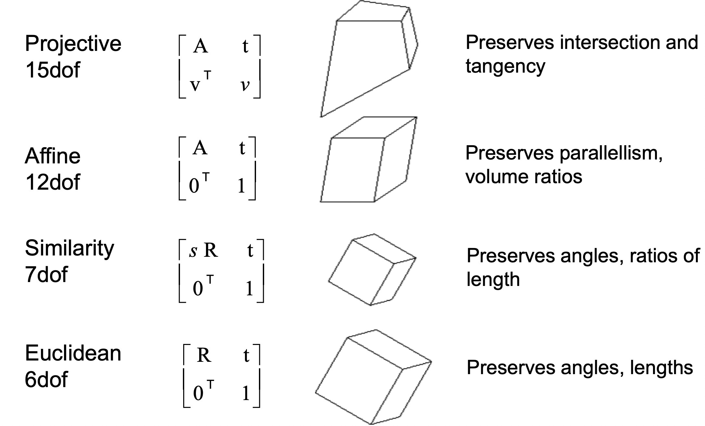
*Figure 1: Ambiguity in SfM representation*

### Occlusion and Limited Viewpoints

Given a sparse set of images:

- For nearby cameras: may get large triangulation errors for far-away points
- For far-away cameras: correspondence can be missed

SfM depends purely on input images to construct a geometric representation of an input scene, so given limited viewpoints
it may struggle to capture comprehensive 3D structures. It will often miss details or occluded areas in the scene, as shown below in Figure 2.

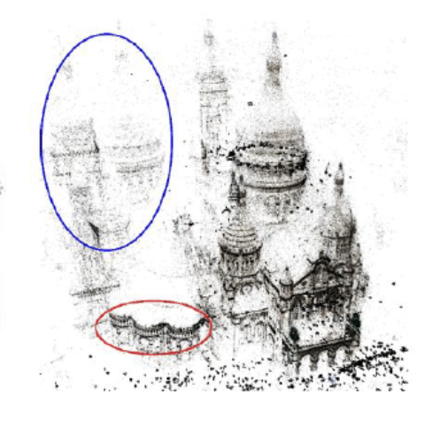
*Figure 2: Missed structures due to limited viewpoints*

The highlighted structures are occluded by larger structures in the central cathedral at certain camera points, leading to missed correspondence and failed point cloud reconstruction.
This can be mitigated with better camera point planning (i.e. if camera positions were planned to include regions between the central cathedral and sides stuctures, occlusion could be limited),
but this is difficult to achieve given limited viewpoints.

### Textureless Surfaces

Low-texture surfaces also pose a unique challenge for SfM based approaches. SfM hinges on identifying corresponding points between different camera positions,
and textured objects make the challenge geometrically easier. Low-texture surfaces, on the other hand, have features that are harder to identify, which can add difficulty to
the correspondence process. Below is an example where low-texture, repetitive surfaces lead to mismatches.

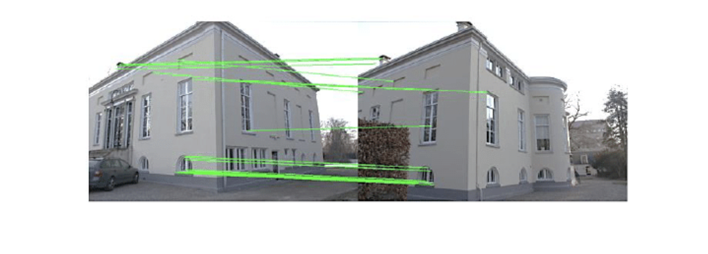
*Figure 3: Low texture*

Non-lambertian surfaces are a unique low-texture case which can cause correspondence mismatching. Reflective or transparent surfaces display different
features depending on the observer's position, so such surfaces can lead to either missed correspondence (where a surface cannot be matched with its previous images)
or incorrect correspondence (which is often more disastrous).

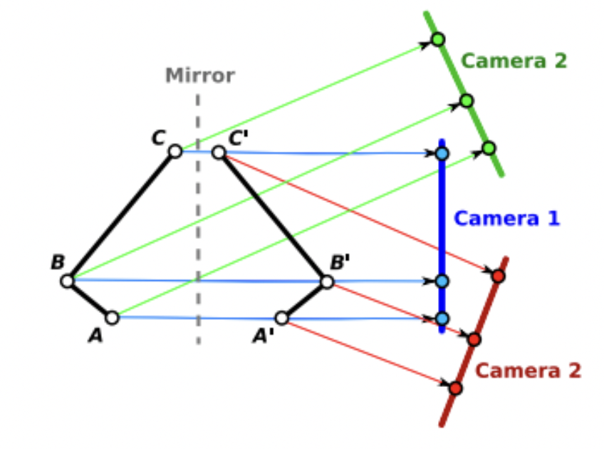
*Figure 4: Reflection*

Above in Figure 4 is an image depicting how a single reflective surface has an inverse surface which could be incorrectly matched depending on the camera position.

### Noise Defects

Global SfM struggles with outliers and noisy input which can cause errors in feature point matching. <br>
Outliers: <br>

- Incorrect correspondence can be detrimental during feature tracking, where features in one frame can be mapped incorrectly to features in another
- During bundle adjustment (where the collection of a point's positions in different frames are mapped into a 3D mesh), this can cause extreme errors with features <br>

General noise between frames can also result in epipolar line mis-estimations. Epipolar lines are used to map camera positions relative to each other, where one camera
will estimate the degree and location of a ray between another camera's optical center and image point. Failures to calculate epipolar lines can create warped estimations of a scene.

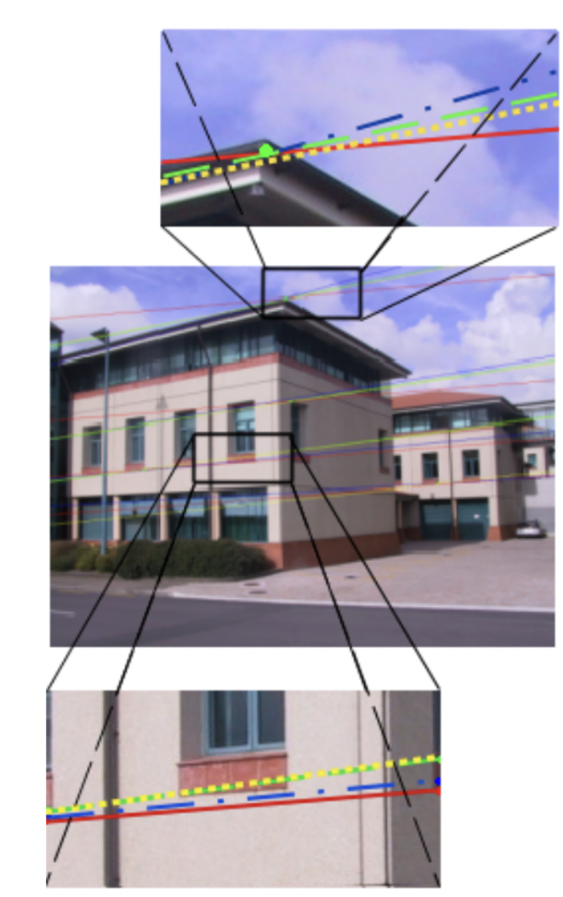 <br>
_Figure 5: Epipolar line mis-estimation with noise_

    Green - ground truth
    Red - added gaussian noise
    Blue - noise + colinearity
    Yellow - noise + coplanar knowledge

## Deep Learning Comes to Rescue

Many modern 3D scene rendering approaches still use Structure from Motion for pre-processing to establish the relative coordinates of the image set, but they also employ further optimization techniques to enable novel view synthesis. These novel optimization techniques are hard to generalize, and so we have selected three specific papers to focus our analysis on. We skip an in-depth analysis of NeRFs as these have already been extensively covered in Assignment 4, as well as in the guest lectures. However, we very briefly re-introduce the general idea, so that we can build off of it later. <br>

[Mildenhall et. al](https://arxiv.org/abs/2003.08934) synthesize images by sampling points in space along camera rays, feeding those locations into a very small MLP $$F_{\Theta}: (x, y, z, \theta, \phi) \rightarrow (R, G, B, \sigma)$$. This produces color and volume density, and using volume rendering techniques, they composite these values into an image. The rendering function is differentiable, so the learned weights $$\Theta$$ can be optimized by minimizing the residual between synthesized and ground truth observed images. Figure 6 below summarizes the outlined process.

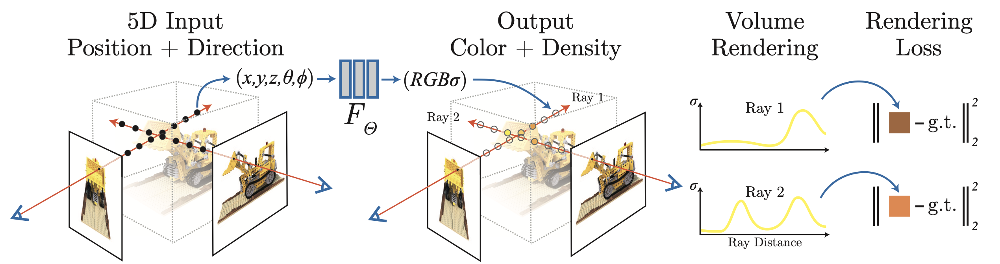 <br>
_Figure 6: NeRF MLP Visualization_

The following code snippet shows how a simple NeRF MLP can be implemented.

```
class NeRFMLP(nn.Module):
    def __init__(self, in_dim, net_dim, num_layers):
        super(SimpleNeRFMLP, self).__init__()

        self.input_layer = nn.Linear(in_dim, net_dim)
        self.middle_layers = [nn.Sequential(nn.Linear(net_dim, net_dim), nn.ReLU())
                            for i in range(num_layers-2)]
        self.middle_layer_block = nn.Sequential(*self.middle_layers)
        self.final_layer = nn.Linear(net_dim, 4)

    def forward(self, x):

        x = self.input_layer(x)
        x = self.middle_layer_block(x)
        out = self.final_layer(x)

        return out
```

The above implementation has variable input dimension, because while the original paper utilizes 5D coordinates, we can also just use 2D image coordinates $$(x, y)$$ or 3D space coordinates $$(x, y, z)$$.

## Instant NGP

As we have seen in Assignment 4, one major drawback of the original NeRF approach is its very high training time. [Müller et. al](https://arxiv.org/abs/2201.05989) suggest a multi-resolution hash encoding of inputs to the MLP that improves the approximation quality and training speed without incurring a notable performance overhead, and generalizes to multiple 3D scene rendering approaches. <br>

In the NeRF paper, scalar positions $$x \in \mathbb{R}$$ are encoded as a multi-resolution sequence of $$L \in \mathbb{R}$$ sine and cosine functions (this step has also been implemented in Assignment 4). Each input dimension is independently encoded using the above formula:

$$\gamma(x)=\left(x, \sin\left(2^0 \cdot x\right), \cos\left(2^0 \cdot x\right), ...,\sin\left(2^{L-1} \cdot x\right), \cos\left(2^{L-1} \cdot x\right) \right)$$

Instead, Instant NGP proposes a trainable hash-based encoding with parameters $$\theta$$, visualized in Figure 7 below.
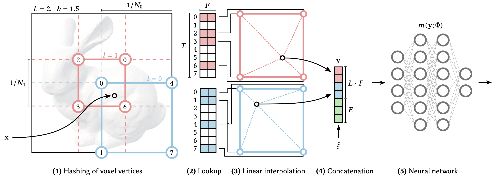 <br>
_Figure 7: Proposed NGP workflow_

For a given input coordinate $$\mathbf{x}$$, we find the surrounding voxels (single samples on a regularly spaced, three-dimensional grid) at $$L \in \mathbb{R}$$ resolution levels and assign indices to their corners by hashing their integer coordinates. The hash function used is

$$h(\mathbf{x}) = \left( \oplus_{i=1}^{d} x_i \pi_i \right) \text{mod} \: T$$

where $$T \in \mathbb{R}$$ represents the hash table size, $$\oplus$$ denotes bitwise XOR operation, and $$\pi_i$$ are unique prime numbers. For all resulting corner indices, we look up the corresponding $$F$$-dimensional feature vectors from the hash tables $$\theta_l$$ and linearly interpolate them according to the relative position of $$\mathbf{x}$$ within the respective $$l$$-th voxel such that the network can learn a smooth function. We concatenate the result of each level, as well as, if any, auxiliary inputs $$\xi \in \mathbb{R}^E$$ (such as view direction or material parameters), producing the encoded MLP input $$\mathbf{y} \in \mathbb{R}^{L \cdot F + E}$$, which is evaluated to predict RGB and density output. To train the encoding, loss gradients are backpropagated through the MLP, the concatenation, the linear interpolation, and then accumulated in the looked-up feature vectors. Thus, this approach has two sets of trained weights, encodings $$\theta$$ and MLP weights $$\Phi$$.

### Performance

Peak signal-to-noise ratio (PSNR) is a commonly used quality measurement between the original and reconstructed image. The higher the PSNR, the better the quality of the compressed, or reconstructed image. It is most easily defined in terms of the mean squared error between two images. Given a noise-free $$m \times n$$ image $$I$$ and its noisy approximation $$K$$, MSE is defined as

$$\text{MSE} = \frac{1}{mn} \sum_{i=0}^{m-1} \sum_{j=0}^{n-1} \left[ I(i,j) - K(i,j) \right]^2$$

and PSNR is further defined as

$$\text{PSNR} = 10 \cdot \log_{10} \left( \frac{\text{MAX}_{I}^{2}}{MSE} \right)$$

where $$\text{MAX}_{I}$$ is the maximum possible pixel value of an image.

Figure 8 below, provided within the Instant NGP paper, documents comparison of PSNR with other scene rendering approaches on a variety of commonly-used scenes. We focus on comparison with the original NeRF and mip-NeRF, which improved upon the original NeRF by efficiently rendering the scene using anti-aliased conical frustums instead of rays. For each scene, the methods with top 3 least errors are marked with gold, silver, and bronze medals.

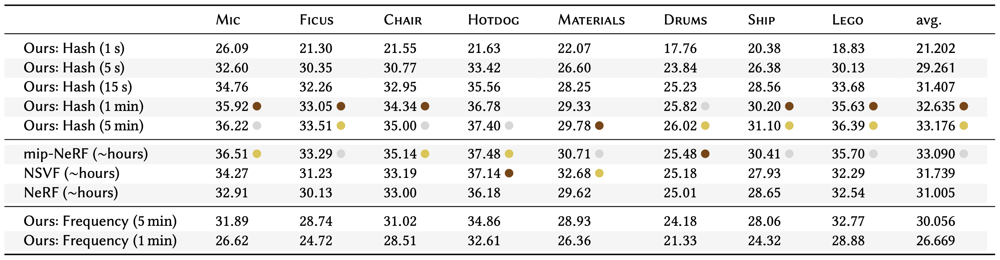 <br>
_Figure 8: Comparison of PSNR achieved using Instant NGP and original NeRF_

We can see that Instant NGP is competitive with NeRF after just 15 seconds of training and competitive with mip-NeRF after 1 to 5 minutes of training, while NeRF-based approaches train in the order of hours. This shows that Instant NGP provides immense upside over original NeRF by improving the training time at least 200x.

## Zero-1-to-3

This 3D scene rendering combines the ideas introduced by NeRFs with diffusion. [Liu et. al](https://arxiv.org/abs/2303.11328) propose a framework for changing the camera viewpoint of an object given just a single RGB image. It capitalizes on the geometric priors of large diffusion models, which show extraordinary zero-shot abilities when generating diverse images from text descriptions. Their pre-trained diffusion model is conditionally finetuned on a synthetic dataset to learn controls of the relative camera viewpoint, which allow new images to be generated of the same object under a specified camera transformation. This viewpoint-conditioned diffusion approach can further be used for the task of 3D reconstruction from a single image.

Given a single RGB image $$x \in \mathbb{R}^{H \times W \times 3}$$, the approach strives to synthesize an image of the object from a different camera viewpoint. Taking $$R \in \mathbb{R}^{3 \times 3}$$ and $$T \in \mathbb{R}^3$$ to be the camera rotation and camera translation of the desired viewpoint, respectively, we want to learn a model $$f$$ that synthesizes a new image under this camera transformation:

$$\widehat{x}_{R,T} = f(x, R, T)$$

One problem this approach is facing is that pre-trained large-scale generative models do not explicitly encode the correspondences between viewpoints. [Liu et. al](https://arxiv.org/abs/2303.11328) solve this problem by using the [_Objaverse_](https://arxiv.org/abs/2212.08051) dataset for fine-tuning, which is a large-scale open-source dataset con- taining 800K+ 3D models created by 100K+ artists. For each object in the dataset, they randomly sample 12 camera extrinsics matrices pointing at the center of the object and render 12 views with a ray-tracing engine. At training time, two views can be sampled for each object to form an image pair $$(x, x_{R,T})$$. The corresponding relative viewpoint transformation $$(R, T)$$ that defines the mapping between both perspectives can be derived from the two extrinsic matrices.

Then, given paired images and their camera extrinsics $$\{(x, x_{R,T}, R, T)\}$$, they fine-tune a pre-trained latent diffusion model to learn controls over the camera parameters. The architecture of the model follows the original Latent Diffusion paper, and is shown in Figure 9 below.

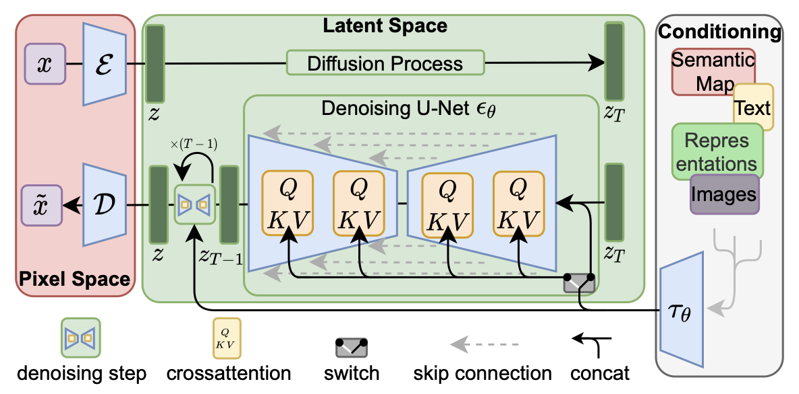 <br>
_Figure 9: Latent Diffusion_

Compared to a standard diffusion model we have implemented in Assignment 4, latent diffusion uses an encoder $$\mathcal{E}$$ to reduce the dimensionality of the original image and thus make diffusion computations more efficient. The forward diffusion process, as well as the denoising backward process using U-Net $$\epsilon_{\theta}$$ are computed in the image latent space and the result is scaled back up to the original dimensionality using a decoder $$\mathcal{D}$$.

At diffusion timestep $$t \sim [0, 1000]$$, taking $$c(x, R, T)$$, the embedding of the input view and camera extrinsics, we minimize the following loss with respect to $$\theta$$:

$$\mathcal{L} = \mathbb{E}_{z \sim \mathcal{E}(x), t, \epsilon \sim \mathcal{N} \sim (0, 1)} || \epsilon - \epsilon_{\theta}(z_t, t, c(x, R, T) ||_2^2$$

Similarly to standard diffusion implemented in Assignment 4, the denoiser U-Net $$\epsilon_{\theta}$$ learns to model the noise added to image at timestep $$t$$, conditioned on the embedding of $$c(x, R, T)$$, so that the inference model $$f$$ can generate an image by performing iterative denoising from a Gaussian noise image. The approach is summarized in Figure 10 below.

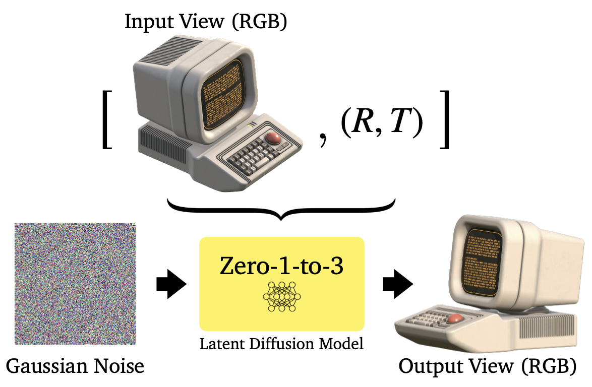 <br>
_Figure 10: Zero-1-to-3, Controlling the camera viewpoint_

The Zero-1-to-3 approach can further be used to synthesize a 3D scene reconstruction, capturing both the appearance and geometry of an object. The authors adopt Score Jacobian Chaining to optimize a 3D representation. The specific implementation of SJC is beyond the scope of this report; however, we show the visualization of this approach in Figure 11 below.

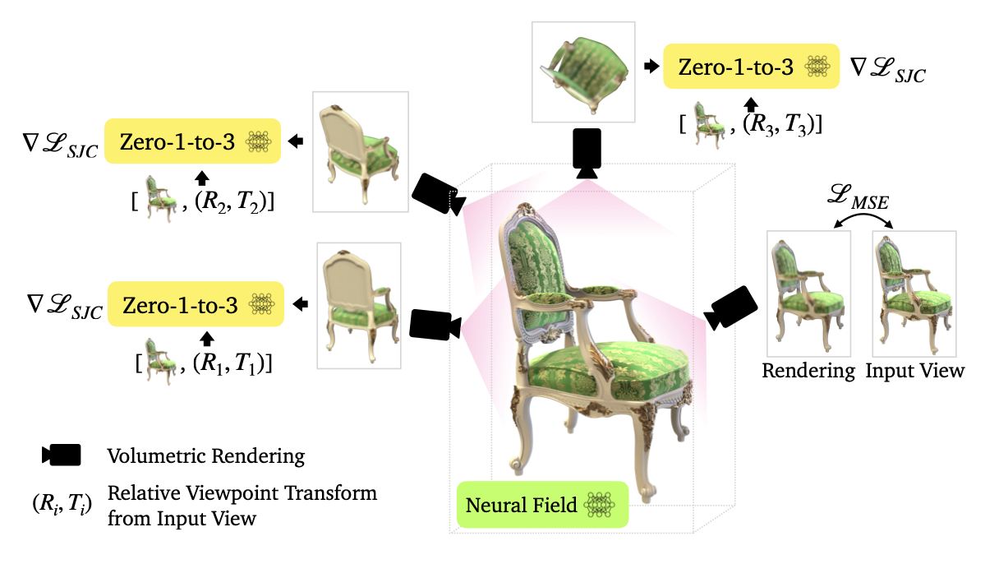 <br>
_Figure 11: Zero-1-to-3, 3D Reconstruction_

### Performance

The approach described above cannot be directly compared performance-wise to the original NeRF or Instant NGP, because the authors directly compare their method only to other methods operating in zero-shot setting and with single-view RGB images. Nevertheless, Figures 12 and 13 show comparison with DietNeRF, which is a NeRF-based approach proposed specifically for few-shot view synthesis.

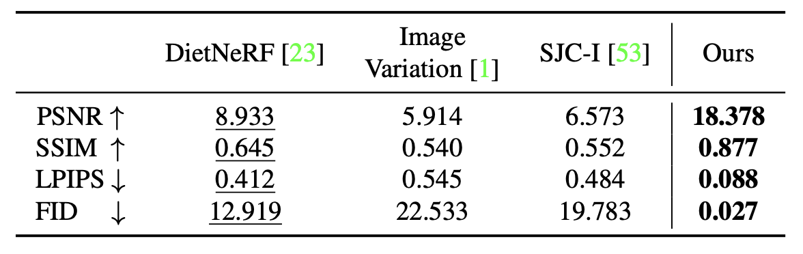 <br>
_Figure 12: Zero-1-to-3, Performance comparison, Google Scanned Objects_

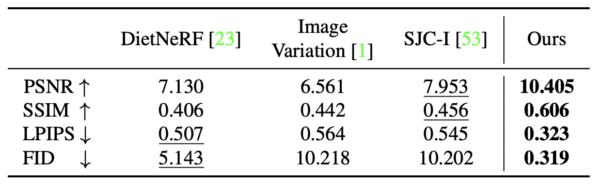 <br>
_Figure 13: Zero-1-to-3, Performance comparison, RTMV_

The two datasets used for benchmarking are Google Scanned Objects, which consists of high-quality scaned household items, and RTMV, consisting of complex scenes of 20 random objects. Furthermore, scenes in RTMV are out-of-distribution from Objaverse data used for fine-tuning the model. Despite that, Zero-1-to-3 still achieves high results, outperforming DietNERF on both benchmarks.

## 3D Gaussian Splatting

After the emergence of Neural Radiance Fields, Gaussian Splatting in 2023 was introduced at SIGGRAPH to also take on the daunting task of 3D scene rendering. In the following, we will be giving a high-level overview of this technique, beginning with the Gaussian Splatting pipeline.

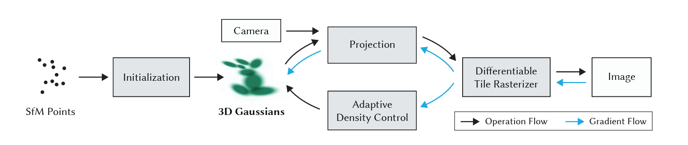 <br>
_Figure 14: Gaussian Splatting Pipeline_

### Sfm and Initialization of Gaussians

As spoken about before, Sfm is quite important to this process as it is the root of our initialization process of these Gaussians. Running images through Sfm, a point cloud is generated, from which a set of Gaussians can be derived. Contexually, 3D Gaussians are defined as a position (mean position), covariance matrix, and an opacity α. From our point cloud, groups of three neighbors will average their positions to form a mean position of the Gaussian. The covariance matrix of the Gaussian would simply be the covariances of the distances w.r.t. to x, y, and z between the 3 points.

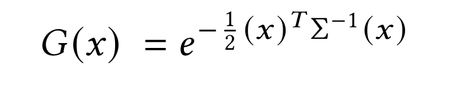 <br>
_Figure 15: 3D Gaussian Distribution_

From this process, we have a achieved an initial set of Gaussians to represent our scene/object in our image set.

### 3D-to-2D GS Projections

Now that we have our Gaussians, we want a method of deriving perspectives of these Gaussians that match our images', similar to the "ray-tracing" in NeRF.

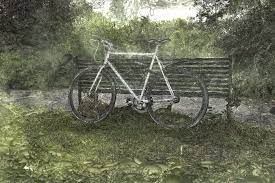 <br>
_Figure 16: Example of 2D Projection of Gaussians that we want to achieve, as this was the angle the original image was shot from._

In the figure above, we have projected our 3D Gaussians to some perspective given by W (viewing transformations) and J (Jacobian of affine transformations), both of which comes from the intrinsics and extrinsics of the camera that took the original shot of the bike (not GS). We can achieve this type of project using:

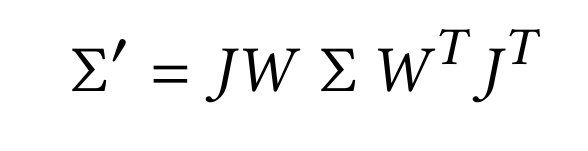 <br>
_Figure 17: New Covariance for 2D Projection of 3D Gaussians._

After some plug-and-chug, we are able to achieve this new covariance that is supposed to accomplish the job of 2D projection. However, as spoken about in the paper, a covariance matrix is only valid for physical representation if positive semi-definite. The running issue is if this matrix somehow becomes corrupt or the gradient updates to this matrix are skewed/wrong, the Gaussian that this matrix represents will be "rendered" (haha pun :D) useless.

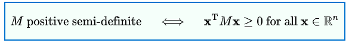 <br>
_Figure 18: Definition of Positive Semi-Definite._

To fix this issue, the authors of 3DGS decided to instead represent the covariance matrix to these Gaussians as Ellipsoidal covariances, thus not only resolving the issue of positive semi-definite-ness, but also making the Gaussian much more flexible, as it is now an ellipsoid, represented by some rotation and scaling.

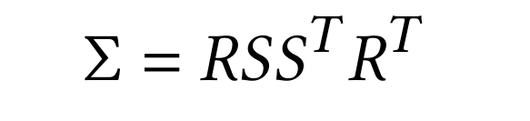 <br>
_Figure 19: Representation of an Ellipsoid._

From here everything can be plugged back into Fig. 15 and that would be our group of projected Gaussians.

### The Rasterizer.

Now we have those sets of Gaussians, but they are projected to some viewing perspective, like that of the bike, and now we have to render our image.

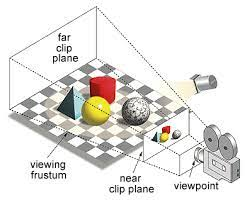 <br>
_Figure 20: The Viewing Frustum_

With the given figure above, the image that is directly infront of the camera is the image that we want to render. On that note, as you may have realized from the previous section that we almost have this image already; we just have to do some tinkering to actually get the the colors and what not, as what we have currently are not pixel values, but rather full Gaussians that we need to extract those densities from.

To accomplish this task, we first "cull" those Gaussians that are not within screen view (we don't want to render what we cannot see) and split the screen into 16x16 tiles. We run through each Gaussian defining Key, Value pairs whereby the

1. Key = (Depth of Gaussian + TileID)
2. Value = the 3D Gaussian.

We can then run a GPU Radix Sort so that as a result, we know for each tile, and thus each pixel in each tile, the Gaussians behind that pixel. From this, we create a list per tile of depth-sorted Gaussians.

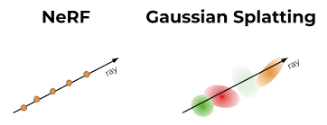 <br>
_Figure 20: NeRF vs. GS Each ray is going through a pixel and there are Gaussians behind those rays._

From there, for each tile, we run a GPU Thread Block (each block tends to have a vast number of threads) to parallelize amongst the 16x16 tiles of the screen. For each pixel in the tile, we then accumulate, like we do in NeRF, colors and opacities along the ray. Of course, if the opacity has reached a certain threshold then we stop, as the colors are so dense we wouldn't see the objects behind it (optimization purposes). After these steps, an image is generated!

### The Backward Pass

The entire process of Gaussian Splatting is fully differentiable, and with that, there is this loss function.

 <br>
_Figure 21: Loss Function_

L1 simply represents "L1 Loss", which is simply pixel2pixel difference. L_D-SSIM is loss due to image similarity.

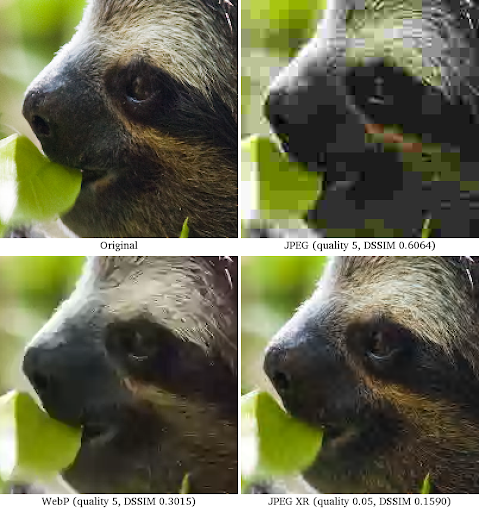 <br>
_Figure 22: D-SSIM_

As you can see, each of the un-original images have some amount of pixelated difference relative to the original sloth photo. L_D-SSIM handles this image similarity correlation. Of course, the two images in question are the original shot photo (for example, like the bike) and the rendered image (after the rasterization process). The gradient that is computed here then flows through the projection process of GS but also the GS Adaptive Density Control.

### Adaptive Density Control

One of the novelties of 3DGS is its ability to shift where these Gaussians are to fill vacant space or simply overpopulated space. The main two issues are

1. Over-Reconstruction
2. Under-Reconstruction

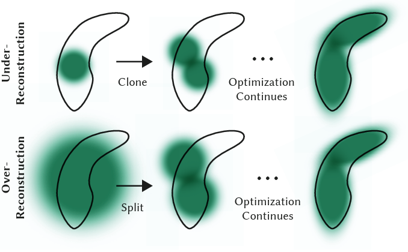 <br>
_Figure 22: Example of Adaptive Density Control_

The above figure is quite explanatory as to the purpose of density control. For under-reconstruction, this is when we have too much vacant white space that in our rendered scene there is absolutely nothing. To solve this issue, we clone an existing nearby Gaussian to help fill this space. After many timesteps, we are able to achieve a nice spread of the environment. For over-reconstruction, this is when we have an over-generalized Gaussian overshadowing a significant part of the scene so we need to partition it. As a result, we divide this specific Gaussian into tinier ones to improve accuracy in our render. Furthermore in ADC, we also get rid of those Gaussians that have no opacity at all (in essence just whitespace to reduce complexity).

### Results

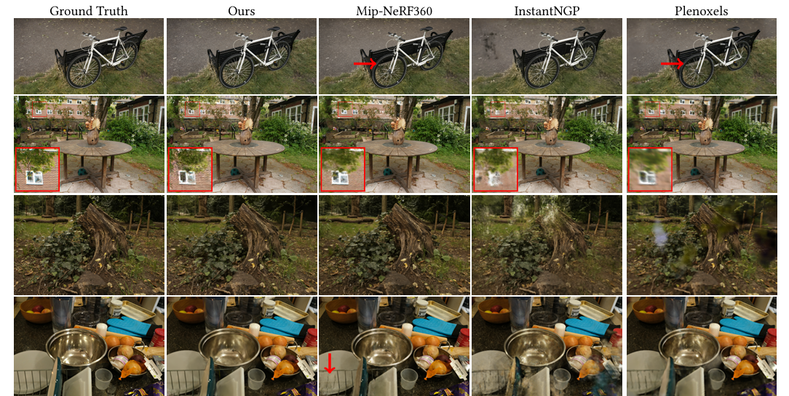 <br>
_Figure 22: Some Results_

As you can see with GS, over several iterations (less than that of NeRF), we can do drastically better on the criterion of accuracy and clarity. In others where an aspect is blurry, GS steps up to overcome this.

## Conclusion

This was a broad overview of some of the bigger topics talked about in this day and age regarding 3D Reconstruction and 3D Rendering, but there's always bigger and better and more niche technology coming in this field that we all need to be on the look out for. Hopefully this was an insightful read of the history and background to viewing the world through a computer. So, with that being said, Go Computer Vision!!

## Code Repositories

## References

[1] Liu, G., Klette, R., & Rosenhahn, B. (2006). Collinearity and Coplanarity Constraints for Structure from Motion. In L. W. Chang & W. N. Lie (Eds.), Advances in Image and Video Technology (Vol. 4319). Springer. Retrieved from [https://doi.org/10.1007/11949534_2](https://doi.org/10.1007/11949534_2)

[2] Alsadik, B. (2014). Guided close range photogrammetry for 3D modeling of cultural heritage sites. Retrieved from [https://doi.org/10.3990/1.9789036537933](https://doi.org/10.3990/1.9789036537933)

[3] Lazebnik, S. (2019). Structure From Motion. Retrieved from [http://www.cs.cmu.edu/~16385](http://www.cs.cmu.edu/~16385)

[4] Mildenhall, B., Srinivasan, P. P., Tancik, M., Barron, J. T., Ramamoorthi, R., & Ng, R. (2020). NeRF: Representing Scenes as Neural Radiance Fields for View Synthesis. CoRR, abs/2003.08934. Retrieved from [https://arxiv.org/abs/2003.08934](https://arxiv.org/abs/2003.08934)

[5] Müller, T., Evans, A., Schied, C., & Keller, A. (2022). Instant Neural Graphics Primitives with a Multiresolution Hash Encoding. CoRR, abs/2201.05989. Retrieved from [https://arxiv.org/abs/2201.05989](https://arxiv.org/abs/2201.05989)

[6] Liu, R., Wu, R., Van Hoorick, B., Tokmakov, P., Zakharov, S., & Vondrick, C. (2023). Zero-1-to-3: Zero-shot One Image to 3D Object. Retrieved from [https://arxiv.org/abs/2303.11328](https://arxiv.org/abs/2303.11328)

[7] Deitke, M., Schwenk, D., Salvador, J., Weihs, L., Michel, O., VanderBilt, E., ... Farhadi, A. (2022). Objaverse: A Universe of Annotated 3D Objects. Retrieved from [https://arxiv.org/abs/2212.08051](https://arxiv.org/abs/2212.08051)

[8] Wang, H., Du, X., Li, J., Yeh, R. A., & Shakhnarovich, G. (2022). Score Jacobian Chaining: Lifting Pretrained 2D Diffusion Models for 3D Generation. Retrieved from [https://arxiv.org/abs/2212.00774](https://arxiv.org/abs/2212.00774)

[9] Jain, A., Tancik, M., & Abbeel, P. (2021). Putting NeRF on a Diet: Semantically Consistent Few-Shot View Synthesis. CoRR, abs/2104.00677. Retrieved from [https://arxiv.org/abs/2104.00677](https://arxiv.org/abs/2104.00677)

[10] Ullman S. (1979). The interpretation of structure from motionProc. R. Soc. Lond. B.203405–426. Retreived from [http://doi.org/10.1098/rspb.1979.0006](http://doi.org/10.1098/rspb.1979.0006)

[11] van Riel, Sjoerd. (2016). Exploring the use of 3D GIS as an analytical tool in archaeological excavation practice. Retreived from [10.13140/RG.2.1.4738.2643](https://www.researchgate.net/publication/303824023_Exploring_the_use_of_3D_GIS_as_an_analytical_tool_in_archaeological_excavation_practice).

[12] Yasutaka Furukawa and Carlos Hernández. (2015). Multi-View Stereo: A Tutorial. Foundations and Trends in Computer Graphics and Vision: Vol. 9: No. 1-2, pp 1-148. Retreived from [http://dx.doi.org/10.1561/0600000052](http://dx.doi.org/10.1561/0600000052)

[13] Bailey, S.W., Echevarria, J.I., Bodenheimer, B. et al. (2015). Fast depth from defocus from focal stacks. Vis Comput 31, 1697–1708. Retreived from [https://doi.org/10.1007/s00371-014-1050-2](https://doi.org/10.1007/s00371-014-1050-2)

---
