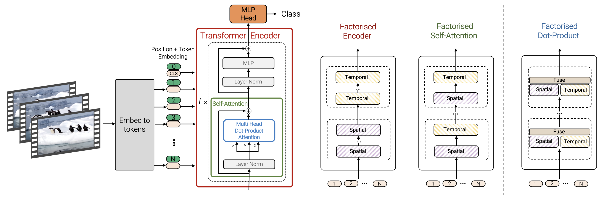

> The ViViT Model for Video Classification

<!--more-->
{: class="table-of-content"}
* TOC
{:toc}

# The ViViT Model for Video Classification

## Introduction: The Evolution of Video Classification Methods

Deep learning technologies have revolutionized video classification.
Initially dominated by traditional machine learning techniques that
relied heavily on human-created features, the field now uses more
sophisticated models capable of learning complex patterns directly from
data. Among these, Convolutional Neural Networks (CNNs) emerged as a
major player, leading advancements in a variety of video-related tasks.
However, the search for models that can comprehend and translate the
complex nature of video data has led to the use of transformer-based
architectures, known for their success in natural language processing
(NLP) and, image classification through the Vision Transformer
model(ViT). In this report, we will be studying the paper \"ViViT: A
Video Vision Transformer\" by Arnab et al., and analyze the unique
methods used to extract features from videos.

### The Challenge of Data in Video Classification

One of the greatest challenges in using transformer models for video
classification is the requirement for large-scale, high-quality
datasets. Videos, by their nature, capture a richer and more complex set
of information than still images, including changes across time,
actions, and interactions within a scene. Capturing the meaning of this
data in a manner that is both comprehensive and nuanced requires vast
amounts of labeled video content, a task that is very difficult to
accomplish. Because there are not many usable datasets around, the use
of transformers for video classification is held back from reaching its
true potential.

### CNNs and the Advent of Attention Mechanisms

CNNs have traditionally been the leader in video-classification efforts,
this is because of their ability to extract spatial relationships well
in data that made them fit for the task. One shortcoming of CNNs
however, is that they do not capture long-range relationships in data
well. This is a key part of video analysis and especially
classification, where relationships can span across the whole video and
different parts of the frame. Recently, leading CNN models have added
self-attention components to help them more effectively decipher the
long-range relationships in different regions of videos. The inclusion
of self-attention models is an important step towards implementing
models that capture relationships in video better, maybe different
architectures other than the CNN are worth a shot\...

## Approach 1: An in-depth examination of the spatiotemporal attention model

The ViViT model\'s architecture seeks to extend the success of
transformer-based architecture for image classification, the Vision
Transformer (ViT), into the video space. The ViViT model treats inputted
videos as spatio-temporally encoded tokens, representing chunks of the
video at different times and areas of the frame.

### Unraveling the Spatiotemporal Fabric of Videos

The main advantage of the spatio-temporal attention model is that the
model is able to better understand the way small pieces of the frame
relate to each other, anywhere across the frame and across the duration
of the video. This allows the model to go past typical CNN architectures
in detecting relationships and appearances across a single frame, but
also relationships across time. This allows for modeling things like
movement of objects or modification of objects across time. This results
in a deep understanding of the video\'s content.

### Addressing the Complexity Conundrum

Because training transformer architectures on videos is incredibly time
and resource-intensive, optimizations like factorization of the spatial
and temporal dimensions of data are employed to cut down on computation
load. Pre trained models are also used whenever possible to cut down on
training computation that could be made redendant. Purposely building
the architecture with efficency as a focus allows the model to be used
with reasonable requirements for training computation.

### Running codebase on ViViT model:

We found a codebase that implements the ViViT transformer model and we
linked it here:
<https://colab.research.google.com/drive/1-URDfwVn-gJVu0URq4NQc3ULIt508wkv#scrollTo=WE9MRYgjqnBW>.
This trains on the MedMNIST dataset and achieves impressive performance
on the dataset.

## Approach 2: Fixing the Complexity Issue with Factorised Dot-Product Attention

This is another of 4 approaches proposed in the paper we are reporting
on. This model improves on the other in terms of time complexity by
factorising the multi-head dot-product attention. The attention weights
for each token gets computed in parallel over the spatial and temporal
components. By doing this, the time complexity of
$O((n_h \cdot n_w)^2 + n_t^2)$ which is a significant improvement over
the first method\'s complexity of $O((n_h \cdot n_w \cdot n_t)^2)$. The
keys and values only attend to those of the same spatial and temporal
index. This means that $K_s$ and $V_s$ correspond to the spatial
dimensions while $K_t$ and $V_t$ correspond to the dimension of time.
For half of the attention heads, we compute the attention for the
spatial component and for the other half we calculate attention for the
temporal component, and we will call this $Y_s$ and $Y_t$ respectively.
Our final output consists of concatenating them and multiplying it by a
matrix to linearly project it: $Y = \mathrm{Concat}(Y_s, Y_t)W_O$

## Curse of Data Sparsity

ViT transformers are known to only be effective when it is trained on a
very large dataset. However, this becomes a much more pressing issue in
the realm of video classification, as the number of video datasets are
far fewer than image datasets. To sidestep these pitfalls, the authors
of this paper use techniques like pretraining and regularization to
achieve results comparable to state of the art techniques, even on
smaller datasets

### Regularization Strategies

The authors found that in general, the more regularization techniques
that were used, the better the model ended up doing. They added
techniques one by one, increasing the top 1 accuracy on the Epic
Kitchens dataset by a few points each time. Some of the techniques used
were random augment, label smoothing, and mixup.

### Initialization

Initialization from pretrained models is very helpful when training on a
dataset that\'s too small. However, since ViViT is a video model and
most pretrained models are for images, the process is more tricky. An
example of this is when trying to initialize positional embeddings. The
video model has $n_t$ times as many tokens as pretrained image models.
To get around this, the authors repeated these tokens along the temporal
space. Similarly, with embedding weights, the filters are also repeated
along the temporal dimension, and averaged out.

## CNN Method vs. ViViT for Categorizing Videos {#cnn-method-vs-vivit-for-categorizing-videos}

### Preface

Deep learning technologies have accelerated the evolution of video
classification, moving from manual features to more complex models like
Convolutional Neural Networks (CNNs) and, more recently,
transformer-based architectures like ViViT. This section examines the
differences between the ViViT model and the CNN approach, as
demonstrated by Karpathy et al., emphasizing the approaches, advantages,
and disadvantages of each for video classification tasks.

### CNN Method for Categorizing Videos

CNNs have contributed significantly to the advancement of video
classification by effectively using the ability to extract spatial
features. This ability is expanded to video data by Karpathy et al.\'s
approach, which introduces techniques for capturing temporal info-a
crucial component of video comprehension. Their research highlights:
**Extending CNNs into the Time Domain:** By investigating different ways
to incorporate temporal dynamics, such as multi-resolution techniques
and the use of 3D convolutions.

-   **Dataset Compilation:** In order to meet the need for large-scale
    data to train deep learning models for video classification, the
    Sports-1M dataset was created. **Performance Enhancements:** By
    putting spatial and temporal data into a CNN framework, this
    approach shows notable improvements over conventional feature-based
    techniques.

### ViViT Method for Categorizing Videos

Motivated by the ViT model\'s performance, and the performance of
transformers in general, the ViViT model represents a shift towards
using transformer-based architectures for video classification. Some key
points to note in the ViViT process are:

-   **Spatio-Temporal Tokenization:** ViViT turns videos into tokens,
    essentially slices of the video representing a certain time and
    section of the frame. This allows the ViViT model to analyze visual
    information and relationships in the frame, while at the same time
    directly analyzing the temporal relationships between different
    tokens. This allows for a deep analysis of spatio-temporal
    relationships
-   **Transformer Architecture:** Because transformers are good at
    capturing long-range relationships within data, the ViViT model is
    able to take advantage of this to effectively model the complex
    relationships and dynamics found in videos, in different parts of
    the frame, and across time as well.
-   **Managing Big Data Sets:** To manage the impossibly high cost of
    fully training models on video data, the ViVit model takes advantage
    of pre-trained models and factorized model variants to cut down on
    computation so that training loads are reasonable.

### Comparative Evaluation

CNNs and ViViT provide strong video classification solutions, but their
approaches and underlying assumptions are very different from one
another.

-   **Model Architecture:** The CNN processes data primarily through
    convolution, and it extends convulution to the time dimension by
    using 3d convolutions as opposed to 2d convolutions typically used.
    The ViViT transformer based model instead turns the videos into
    spatio-temporal tokens, and uses a purely transformer-based
    architecture to classify
-   **Temporal Dynamics:** The CNN gradually adds temporal data to the
    model throughout its convolutional architecture, while the ViViT
    model stores the data as tokens with temporal information directly
    built in.
-   **Computational Efficiency:** 3D convolutions used in the CNN
    architecture are extremely computationally demanding, and so CNNs
    struggle with long videos. The transformer-based model is also
    computationally demanding, but there are some optimizations that can
    be applied to mitigate this, like factorization of the spatial and
    temporal dimensions of the input.

## Final Thoughts

Looking into the use of CNN models and transformer-based models shows
how fast-moving and dynamic the field of computer vision is. Although
CNN models led the way originally with video classification,
transformers have shown that they can perform some aspects of video
analysis better than CNNs, like long range relationships. The future of
this field is exciting, and fixing the shortcomings of our current best
models with innovative new models will lead us there.

# References

\[1\] Anurag Arnab and Mostafa Dehghani and Georg Heigold and Chen Sun
and Mario Lučić and Cordelia Schmid. ViViT: A Video Vision Transformer
2021

\[2\] Karpathy et al. Large-scale Video Classification with
Convolutional Neural Networks
